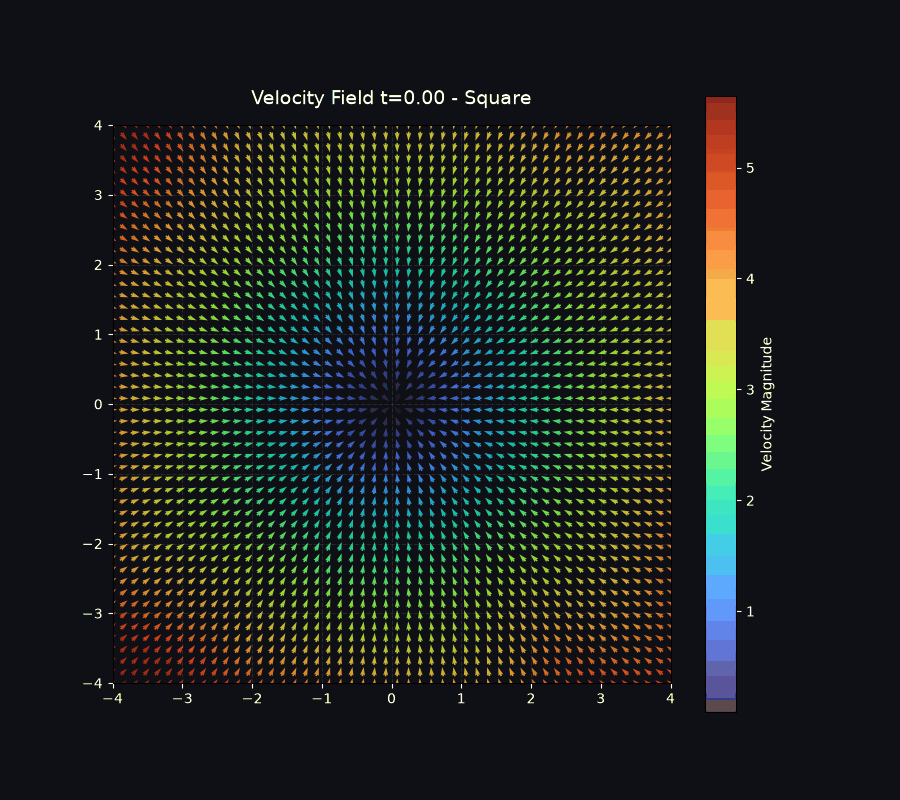
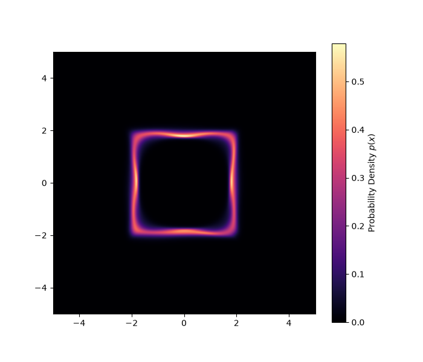

# jax-flow-matching

A high-performance continuous-time flow matching engine built in JAX, Equinox, and Diffrax. 

This repository implements a scalable generative framework that maps a standard normal prior to complex target distributions via neural velocity fields. It bypasses the computational overhead of optimal transport by relying on independent coupling, focusing instead on heavily optimized, JIT-compiled training loops and memory-efficient ODE integration.

## Core Architecture

* **Pure JAX/Equinox:** Fully functional neural velocity field architecture (`NeuralVelocityField`) utilizing `jax.lax.scan` to bypass Python interpreter overhead and keep the GPU saturated during training.
* **VRAM Data Locking:** Eliminates XLA compilation bloat by locking normalized datasets directly into GPU memory as pure `DeviceArray` pointers prior to JIT compilation.
* **Continuous-Time Dynamics:** Uses `Diffrax` (Tsit5) to solve the underlying probability flow ODEs during both inference and evaluation.
* **Trace Estimation:** Implements a custom Skilling-Hutchinson trace estimator to approximate the divergence of the neural vector field, enabling exact log-likelihood (NLL) computation via augmented ODEs without full Jacobian calculations.

## Qualitative Results: 2D Manifolds

The model seamlessly learns highly non-linear 2D topological structures. The neural velocity field $v(t,x)$ successfully transports particles from a Gaussian prior to the target manifolds.

<p align="center">
  
  
</p>
*Left: Evolution of the neural velocity field over time t in [0, 1]. Right: Final generated probability density.*

## Quantitative Evaluation: High-Dimensional Scaling

To verify the architecture scales beyond 2D toy problems, the model was evaluated on the 30-dimensional Breast Cancer continuous dataset. 

* **Baseline (Standard 30D Gaussian):** ~42.5 NLL
* **Our Flow Matching Model:** 3.55 NLL

*Evaluated on an unseen 20% test split. The model successfully compressed the probability density into the 30D target manifold, lowering the NLL significantly without overfitting the limited sample size (evaluated using a 64x3 MLP capacity).*

## Usage

### 1. Training on Toy 2D Distributions
Generate and train on mathematical distributions (e.g., `square`, `double_spiral`, `ring`):
```bash
python run.py --mode train --shape double_spiral --epochs 16384


### Using Custom Datasets

To train the flow on your own data, prepare a binary NumPy array (`.npy`) that meets the following specifications:
* **Format:** Single `.npy` file (not `.npz`).
* **Shape:** `(N_samples, D_dimensions)`.
* **Type:** `np.float32` (JAX default precision).
* **Scale:** Data must be pre-normalized ($\mu=0, \sigma=1$) to prevent ODE solver stiffness.

```python
import numpy as np

# Example custom data preparation
my_data = np.random.randn(10000, 50).astype(np.float32)
np.save("my_custom_dataset.npy", my_data)
